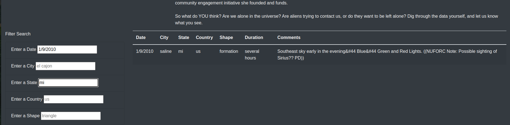
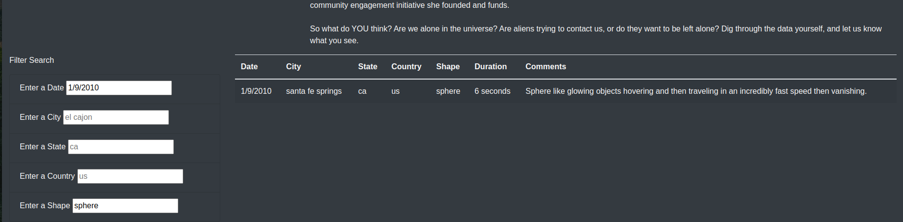

# UFOs
Creating a dynamic web page using HTML, CSS, Bootstrap and JavaScript.

## Background
### Overview
This project consists of one technical analysis deliverable and a written report:

- Deliverable 1: Filter UFO sightings on multiple criteria

- Deliverable 2: A written report on the UFO analysis (README.md)

### Purpose
To provide an in-depth analysis of UFO sightings by allowing users to filter for multiple criteria at the same time. In addition to the date, we added table filters for the city, state, country, and shape.

## Methodology
- Using JavaScript and HTML, we modifyied the code in our index.html file to create more table filters. In addition to the date filter we created, we added filters for the city, state, country, and shape. 
- Using JavaScript, we replaced the handleClick() function in our app.js file with a new function that saved the element, value, and id of the filter that was changed. Then, we created a new function to loop through the dataset and keept only the results that matched the search criteria. The webpage will be updated with the search criteria after pressing "Enter".

## Resources
 
Data source:
- (1) app.js, (2) index.html, (3) data.js
 
Software:
- Visual Studio Code 1.68.1, HTML, CSS, Bootstrap and JavaScript
 
 

### Results

Using JavaScript and HTML, we re-factored the code of our index.html file to create more table filters. Now the client would be able to filter not only be date, but by city, state, country, and shape, as shown in Figure (a). Then the webpage will be updated with the search criteria after pressing "Enter".

 

(a) 

 Figure (a) Filter UFO sightings on multiple criteria

 

This deployed webpage has 5 dynamic filter that our client can interact with. The filters can be used independently from each other or in any combination to filter the table for the desire data output. For our demostration we will filter first by date to show how the webapp works with one filter at a time, as shown in Figure (b).

(b)

 Figure (b) Filtered by Date.

In order to demostrate to the client how they can combine filters, we filtered the table by date and then by combining with all the different filters availabels in the page, as shown in Figure (c - f).

(c)

 Figure (c) Filtered by Date and City

(d)

 Figure (d) Filtered by Date and State.

(e)

 Figure (e) Filtered by Date and Country.

(f)
 
 Figure (f) Filtered by Date and Shape

 

## Summary

- For this project we were able to create a dynamic webpage that provided the client an effective way to filter the table with multiple criterias based on theire inputs. In order to let the client to try and feel the app we deployed the webpage using GitHub pages:

     - [link to deployed webpage](https://l-aldarondo.github.io/UFOs/)

- One drawback of this page is that the user interaction with the page is limited to the filters. The page dosen't provide a way to provide feedback, help section or FAQ. In addition the client needs to manually clear the filters to reset the page.

- For future development we would consider the following:
    - Provide a way for the user to clear all the filters at once, by adding a "clear filters button".
    - Provide a way to filter by keyword on the entire webpage, by adding an "input box".
    - Adding a FAQ or help sections with links and some information on how to use the page.

This improvements will allowd the page to be more dynamic, user friendlly and provide a more inmersive experience for the end user.

 

## References

[Markdown](https://docs.github.com/en/get-started/writing-on-github/getting-started-with-writing-and-formatting-on-github/basic-writing-and-formatting-syntax)
 
[Bootstap Grid system](https://getbootstrap.com/docs/3.3/examples/grid/)
 
[Bootstrap CSS](https://getbootstrap.com/docs/3.3/css/)

